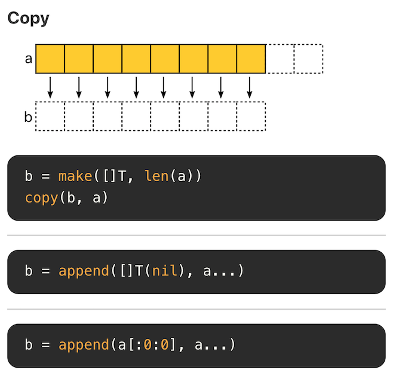
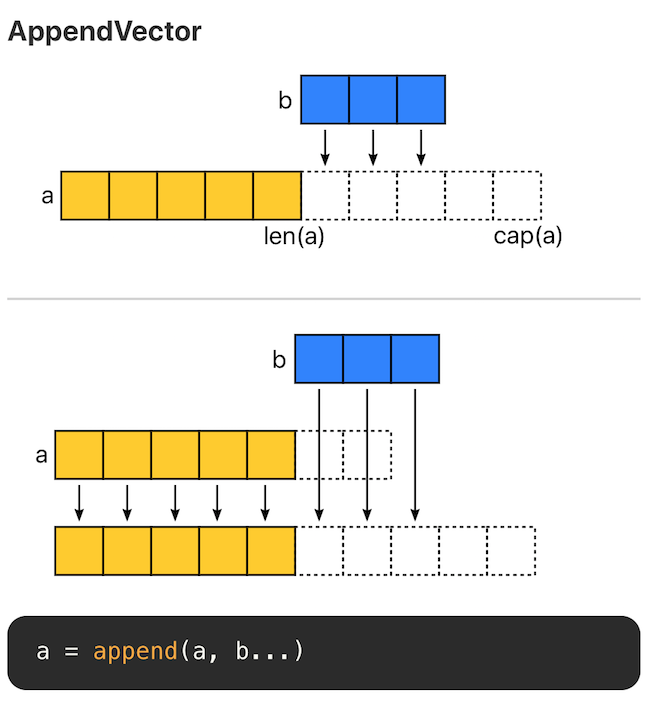
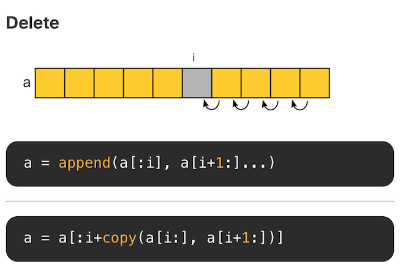
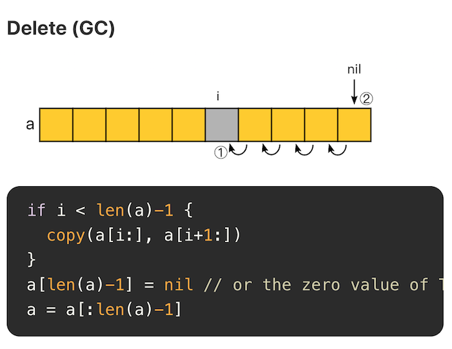
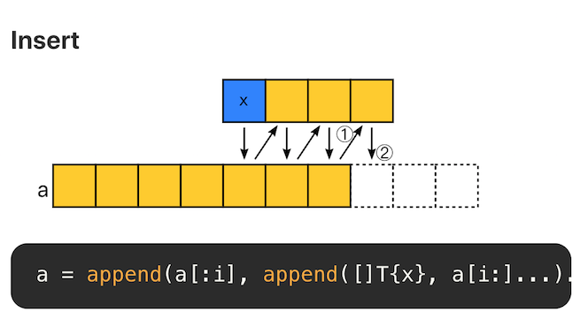
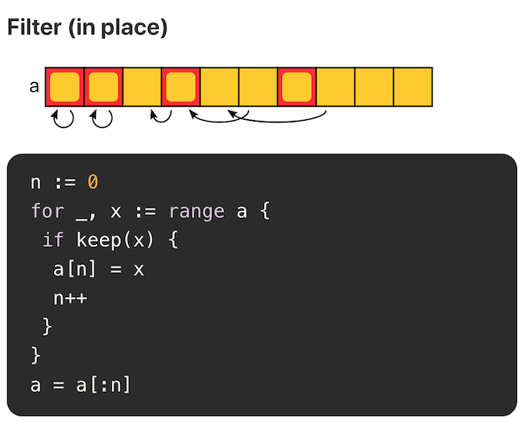
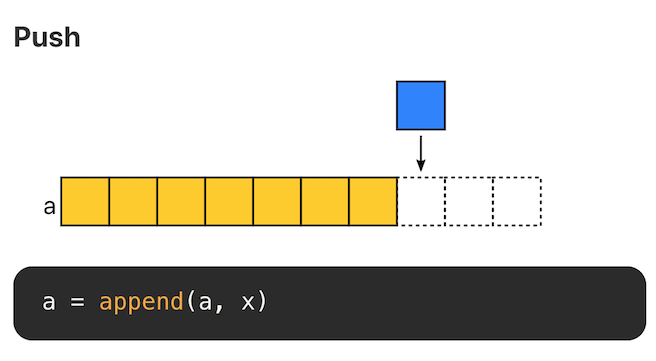
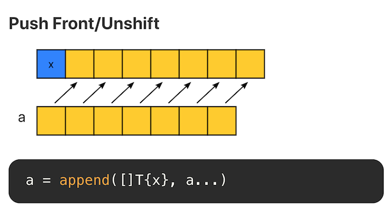
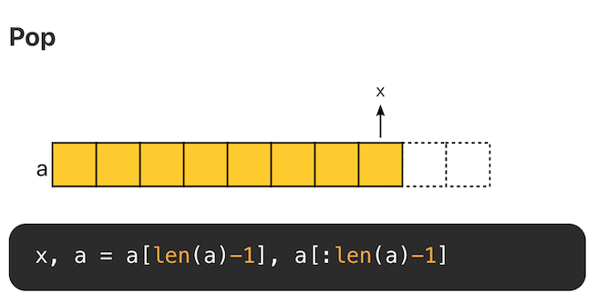
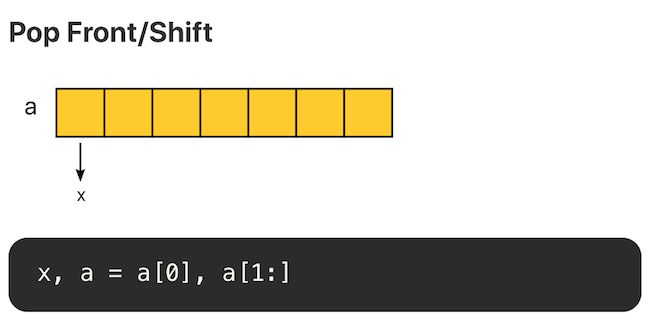

# sliceNotes

---

# 1. 切片的本质

## 1.1 数组

1. 数组的长度固定，可以指定也可以自动计算
2. 不同长度的数组属于不同类型，
3. 数组变量进行赋值时，是值传递，也就是完整的复制，

```go
package main

import "fmt"

func main() {
	a := [3]int{1, 2, 3}
	b := a
	c := &a
	a[0] = 0
	fmt.Printf("b: %v\n", b)
	fmt.Printf("c: %v\n", c)
}

// Output:
b: [1 2 3]
c: &[0 2 3]
```

## 1.2 切片

1. 切片是在数组上的引用，就像是对数组的形容或者抽象描述
    
    ```go
    struct {
        ptr *[]T
        len int
        cap int
    }
    ```
    
2. 切片包含三部分信息，引用指针，引用的长度，以及该切片的容量；
3. 当切片的长度要超出容量时，需要进行扩容，因此如果一开始能够预先估计切片容量，可以减少内存分配的次数
    
    ```go
    s := make([]T, len, cap)
    ```
    
4. 如果不使用make创建切片，而是采用字面量的形式，则切片的长度和容量会自动计算
5. 切片的赋值是引用型赋值，因此若包含相同的段，则修改是可见的
    
    ```go
    m := []int{1, 2, 3}
    fmt.Println(len(m), cap(m))
    n := m
    n[0] = 0
    n = append(n, 4)
    fmt.Println(n)
    fmt.Println(m)
    m = append(m, -1)
    fmt.Println(n)
    fmt.Println(m)
    
    // Output:
    3 3
    [0 2 3 4]
    [0 2 3]
    [0 2 3 4]
    [0 2 3 -1]
    
    //由于切片的底层引用长度只有3， 因此后续的添加不同的切片有不同的结果
    ```
    
    ```go
    //
    m := make([]int, 0, 4)
    m = append(m, 1, 2, 3)
    fmt.Println(len(m), cap(m))
    n := m
    n[0] = 0
    n = append(n, 4)
    fmt.Println(n)
    fmt.Println(m)
    m = append(m, -1)
    fmt.Println(n)
    fmt.Println(m)
    
    3 4
    [0 2 3 4]
    [0 2 3]
    [0 2 3 -1]
    [0 2 3 -1]
    ```
    

# **2 切片操作及性能**

搞清楚切片的本质之后，理解切片的常用操作的性能就容易很多了。

Go 语言在 Github 上的官方 wiki - [SliceTricks](https://github.com/golang/go/wiki/SliceTricks) 介绍了切片常见的操作技巧。另一个项目 [Go Slice Tricks Cheat Sheet](https://ueokande.github.io/go-slice-tricks/) 将这些操作以图片的形式呈现了出来，非常直观。

## **2.1 Copy**



## **2.2 Append**



切片有三个属性，指针(ptr)、长度(len) 和容量(cap)。append 时有两种场景：

- 当 append 之后的长度小于等于 cap，将会直接利用原底层数组剩余的空间。
- 当 append 后的长度大于 cap 时，则会分配一块更大的区域来容纳新的底层数组。

> 因此，为了避免内存发生拷贝，如果能够知道最终的切片的大小，预先设置 cap 的值能够获得最好的性能。
> 

## **2.3 Delete**



切片的底层是数组，因此删除意味着后面的元素需要逐个向前移位。每次删除的复杂度为 O(N)，因此切片不合适大量随机删除的场景，这种场景下适合使用链表。

## **2.4 Delete(GC)**



删除后，将空余的位置置空，有助于垃圾回收。

## **2.5 Insert**



insert 和 append 类似。即在某个位置添加一个元素后，将该位置后面的元素再 append 回去。复杂度为 O(N)。因此，不适合大量随机插入的场景。

## **2.6 Filter**



当原切片不会再被使用时，就地 filter 方式是比较推荐的，可以节省内存空间。

## **2.7 Push**



在末尾追加元素，不考虑内存拷贝的情况，复杂度为 O(1)。



在头部追加元素，时间和空间复杂度均为 O(N)，不推荐。

## **2.8 Pop**



尾部删除元素，复杂度 O(1)



头部删除元素，如果使用切片方式，复杂度为 O(1)。但是需要注意的是，底层数组没有发生改变，第 0 个位置的内存仍旧没有释放。如果有大量这样的操作，头部的内存会一直被占用。

# 3. 切片的注意事项

不要因为使用切片不会额外创建空间而大量使用切片

1. 使用切片不会额外创建空间是建立在所创建的切片的长度、容量不超过底层数组
2. 大量的切片（无论长短）都保留着对原有数组的引用，如果底层数组很长，而引用的切片很短，则会导致底层大量元素不能进行垃圾回收，浪费内存